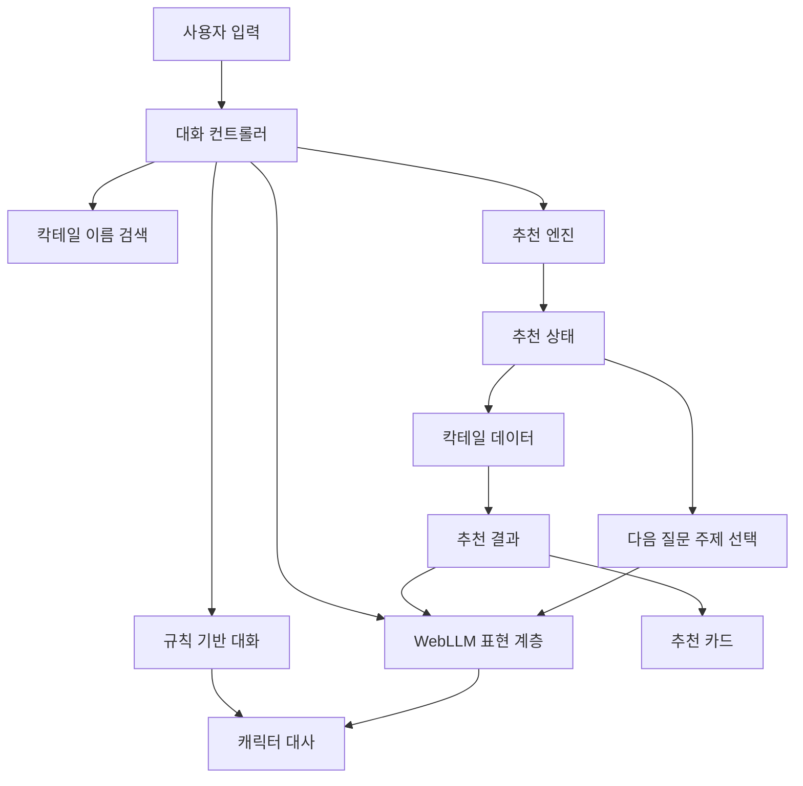

<div align="center">

# Re:Station

### 한 잔의 술과 한 번의 대화를 통해 잠시 쉬어가는 가상의 바

캐릭터 대화와 취향 탐색을 결합한 웹 기반 칵테일 추천 서비스


</div>

---

## Re:Station

**Re:Station**은 칵테일 추천과 캐릭터 대화를 결합한 웹 기반 바 시뮬레이션 서비스입니다.

사용자는 가상의 바 Re:Station에 방문한 손님이 되어 바텐더와 짧은 대화를 나누고, 자신의 기분과 취향에 맞는 칵테일을 추천받을 수 있습니다.

Re:Station은 상담소가 아닙니다.

문제를 해결해주기보다 대화와 농담, 한 잔의 추천을 통해 잠시 다른 방향을 바라볼 수 있는 경험을 제공합니다.

> 문제를 해결해주지는 않지만, 문제만 바라보고 있게 두지도 않는 곳.

---

## 주요 특징

### 캐릭터와 나누는 대화

정형화된 추천 문구 대신 캐릭터의 성격과 말투를 반영한 대화를 제공합니다.

### 설문처럼 느껴지지 않는 추천

고정된 설문을 한 번에 제시하지 않습니다.

현재까지 파악한 취향과 답변 이력에 따라 필요한 질문을 하나씩 선택하고, 자유 입력과 선택 버튼을 함께 지원합니다.

### 데이터 기반 칵테일 추천

칵테일 추천 결과는 규칙 기반 추천 엔진과 칵테일 데이터에서 결정됩니다.

LLM은 추천 결과를 변경하지 않고 캐릭터다운 대화와 추천 설명을 담당합니다.

### 브라우저에서 실행되는 로컬 AI

WebLLM을 활용하여 캐릭터 대화와 추천 설명을 브라우저 내부에서 생성하는 구조를 준비하고 있습니다.

WebLLM을 사용할 수 없는 환경에서도 규칙 기반 대화와 추천 기능을 이용할 수 있습니다.

---

## 주요 캐릭터

### 카루아

> 웃기려고 한 말이 가끔 본질을 건드리는 사람.

Re:Station의 바텐더 알바생이자 현재 MVP의 메인 대화 캐릭터입니다.

- 상냥하고 능청스러운 대학생
- 농담으로 먼저 분위기를 환기함
- 놀리지만 비꼬지 않음
- 정답이나 직접적인 위로를 제시하지 않음
- 웃기고 나서 생각하게 만드는 말투

### 시에스타

> 사람을 오래 봤고, 오래 실패해봤지만 아직 사람을 포기하지 않은 바텐더.

Re:Station의 사장입니다.

현재 MVP에서는 낮은 빈도로 등장하는 짧은 만담 이벤트 캐릭터로 계획되어 있습니다.

- 짧고 건조하며 담담한 말투
- 경험과 관찰에서 나온 말을 툭 던짐
- 설교하거나 정답을 제시하지 않음
- 생각하게 만들고 나서 웃기는 말투

---

## 주요 기능

- 캐릭터 기반 대화
- 초기 환영 메시지
- 기분·상황·취향 기반 칵테일 추천
- 현재 추천 상태에 따른 적응형 질문
- 자유 입력과 선택 질문 버튼
- 추천 질문 취소
- 카루아에게 선택 맡기기
- 현재 적용된 추천 조건 표시 및 제거
- 도수와 맛 프로필 기반 추천
- 무알코올 및 제외 재료 조건 처리
- 추천 칵테일 카드 표시
- 칵테일 도감 영구 저장
- 모바일 화면 대응
- WebLLM Worker 및 모델 평가 기반

---

## 시연 화면

### 메인 화면


### 대화형 추천


### 추천 결과


### 칵테일 도감


### 모바일 화면


---

## 기술 스택

### Frontend

| 기술 | 역할 |
|---|---|
| React | 사용자 인터페이스 구성 |
| TypeScript | 애플리케이션 타입 계약 관리 |
| Vite | 개발 서버와 프로덕션 빌드 |
| CSS | 바 분위기, 반응형 화면, 캐릭터 연출 |

### Recommendation

| 기술 | 역할 |
|---|---|
| JSON 칵테일 데이터 | 칵테일 정보와 추천 근거 관리 |
| 규칙 기반 추천 엔진 | 추천 상태, 질문 주제, 최종 결과 결정 |
| 적응형 질문 시스템 | 기존 답변과 추천 상태에 따라 다음 질문 선택 |

### Local AI

| 기술 | 역할 |
|---|---|
| WebLLM | 브라우저 내부 로컬 LLM 실행 |
| Web Worker | 모델 생성 작업과 UI 스레드 분리 |
| 캐릭터 프롬프트 | 카루아와 시에스타의 말투 표현 |
| 규칙 기반 복구 경로 | WebGPU 미지원 또는 모델 오류 시 기본 경험 제공 |

### Quality

| 기술 | 역할 |
|---|---|
| Vitest | 추천·검색·상태·캐릭터 계약 테스트 |
| ESLint | 코드 품질 검사 |
| TypeScript Compiler | 정적 타입 검사 |

---

## 아키텍처



### 책임 분리

- **추천 엔진**은 질문 주제, 추천 상태, 칵테일 결과를 결정합니다.
- **칵테일 데이터**는 추천 결과와 근거의 단일 진실 공급원입니다.
- **WebLLM**은 캐릭터 대화, 질문 표현, 추천 설명을 담당합니다.
- **규칙 기반 대화 엔진**은 WebLLM 없이도 기본 경험을 제공합니다.
- LLM은 추천 엔진이 결정한 결과를 임의로 변경하지 않습니다.

---

## 실행 방법

### 요구 환경

- Node.js
- npm
- WebLLM 사용 시 WebGPU 지원 브라우저

### 설치

```bash
cd bar_tend
npm install
```

### 개발 서버 실행

```bash
npm run dev
```

### 테스트

```bash
npm test
```

### 린트

```bash
npm run lint
```

### 타입 검사

```bash
npm run check
```

### 프로덕션 빌드

```bash
npm run build
```

---

## 프로젝트 구조

```text
pracbar/
├─ bar_tend/
│  ├─ src/
│  │  ├─ components/       # 화면 및 UI 컴포넌트
│  │  ├─ data/             # 칵테일과 평가 데이터
│  │  ├─ hooks/            # 대화 및 추천 세션 상태
│  │  ├─ lib/
│  │  │  ├─ akinator/      # 적응형 추천 질문 엔진
│  │  │  ├─ bartender/     # 규칙 기반 캐릭터 대화
│  │  │  ├─ cocktails/     # 칵테일 데이터와 검색
│  │  │  ├─ recommendation/# 추천 상태와 근거
│  │  │  ├─ storage/       # 도감과 세션 저장
│  │  │  └─ webllm/        # WebLLM Worker와 프롬프트
│  │  └─ App.tsx
│  └─ package.json
└─ mission_control/        # 기획, 설계, 결정 및 작업 기록
```

---

## 개발 현황

### 완료

- Re:Station 브랜드와 캐릭터 기반 대화
- 칵테일 데이터 모델 통합
- 규칙 기반 카루아 대화 엔진
- 적응형 추천 질문
- 자유 입력과 선택 질문 버튼
- 추천 조건 표시 및 제거
- 추천 질문 취소와 카루아에게 맡기기
- 도감 영구 저장
- 모바일 UI와 접근성 보강
- WebLLM Worker 및 평가 기반
- 캐릭터 말투 프롬프트 초안

### 진행 중

- WebLLM 최종 모델 평가 및 선정
- 캐릭터 RP 일관성 평가
- 실제 WebLLM 대화 흐름 연결

### 향후 계획

- 추천 카드 상세 정보와 추천 근거 표시
- 시에스타 만담 이벤트
- WebLLM 다운로드 진행률 및 오류 복구 UI
- 주요 사용자 흐름 테스트 확대
- 체감 응답 속도 최적화

---

## 프로젝트 문서

- [프로젝트 비전](./mission_control/PROJECT_VISION.md)
- [캐릭터 설계](./mission_control/CHARACTER_DESIGN.md)
- [작업 보드](./mission_control/TASK_BOARD.md)
- [현재 상태](./mission_control/CURRENT_STATE.md)
- [WebLLM 평가](./mission_control/WEBLLM_EVALUATION.md)
- [WebLLM 프롬프트 초안](./mission_control/WEBLLM_PROMPT_DRAFT.md)
- [작업 이력](./mission_control/WORK_LOG.md)
- [인수인계](./mission_control/HANDOVER.md)

---

<div align="center">

### 잠시 앉아 있다 가세요.

문제는 그대로여도, 보는 방향 정도는 바뀔지 모르니까요.

</div>
